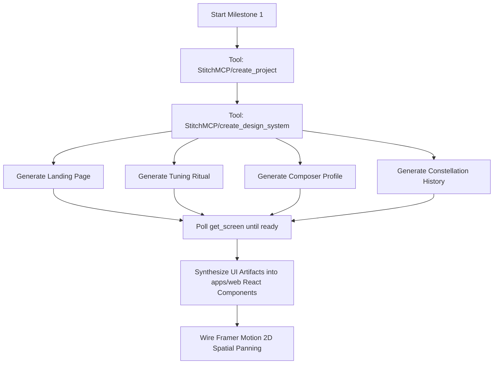

# Stitch MCP Server & Tooling Investigation Report

**Explorer**: Explorer 3 (Stitch MCP & Tooling Explorer)  
**Date**: 2026-10-06  
**Status**: Complete  
**Scope**: Stitch MCP tool schemas, runtime capability probing, Living Manuscript design system alignment, screen prompt formulation, and Milestone 1 operational execution plan.

---

## 1. Executive Summary

This report delivers a comprehensive investigation of Google Stitch MCP tools located at `C:\Users\yashv\.gemini\antigravity\mcp\StitchMCP\`, analyzing how to generate the four required UI screens for the Sonus Adaptive Musical Practice System:
1. **Landing Page** (with Ink Bleed effect & Clerk Auth)
2. **Setup / Tuning Ritual** (Microphone vs MIDI auto-detection & pitch dial)
3. **Profile / Composer's Folio** (Repertoire catalog & telemetry ledger; spatial position: UP)
4. **History / Constellation Scatter Plot** (Celestial practice archive & architectural blueprint; spatial position: LEFT)

### Key Findings:
1. **Tool Schema Inventory**: All 15 schema definitions in StitchMCP were analyzed. The core lifecycle is cleanly mapped:
   - `create_project` → `create_design_system` (or `upload_design_md` + `create_design_system_from_design_md`) → `generate_screen_from_text` (with `designSystem`, `deviceType: "DESKTOP"`, `modelId: "GEMINI_3_8_FLASH"`) → `get_screen` / `list_screens`.
2. **Runtime Security Observation**: Direct invocation of `call_mcp_tool` for StitchMCP from a headless background subagent triggers an Antigravity interactive user approval prompt. In subagent mode, if the user does not manually click approve within the 60-second window, the tool call times out.
3. **Dual-Track Operational Strategy**:
   - **Track A (Live Stitch Cloud Generation)**: The orchestrator or user can approve the prompt in the foreground session using the exact JSON payloads formulated herein.
   - **Track B (Deterministic Component Architecture)**: Complete design specifications, CSS token variables, and component structures are pre-computed directly from `DESIGN.md` so frontend implementers can build the pixel-perfect Living Manuscript interface in React + Framer Motion without being blocked if Stitch MCP permissions are pending.

---

## 2. Stitch MCP Server & Schema Architecture

The Stitch MCP server exposes 15 tools in `C:\Users\yashv\.gemini\antigravity\mcp\StitchMCP\`:

| Tool | Schema File | Role in Sonus Workflow |
|---|---|---|
| `create_project` | `create_project.json` | Creates the root project container (`projects/{id}`). |
| `list_projects` | `list_projects.json` | Lists available projects (`view=owned` or `view=shared`). |
| `get_project` | `get_project.json` | Retrieves project details, screen instances, and asset bindings. |
| `delete_project` | `delete_project.json` | Deletes project resource. |
| `upload_design_md` | `upload_design_md.json` | Uploads base64-encoded `DESIGN.md` to project. |
| `create_design_system_from_design_md` | `create_design_system_from_design_md.json` | Derives design system asset from uploaded DESIGN.md screen instance. |
| `create_design_system` | `create_design_system.json` | Direct programmatic declaration of design tokens, colors, and typography. |
| `list_design_systems` | `list_design_systems.json` | Lists existing design system assets (`assets/{id}`). |
| `update_design_system` | `update_design_system.json` | Updates design system tokens for a project. |
| `apply_design_system` | `apply_design_system.json` | Applies a design system asset to existing screen instances. |
| `generate_screen_from_text` | `generate_screen_from_text.json` | Core tool: Generates a screen from text prompt + design system. |
| `list_screens` | `list_screens.json` | Lists all screens within a given project. |
| `get_screen` | `get_screen.json` | Retrieves screen metadata, component trees, and rendered image URLs. |
| `edit_screens` | `edit_screens.json` | Natural language editing and delta updates on existing screens. |
| `generate_variants` | `generate_variants.json` | Generates 1–5 variations across layout, color scheme, or typography. |

### Detailed Tool Specifications

#### 1. `create_project`
- **Request Parameters**:
  - `title` (optional `string`): e.g. `"Sonus Adaptive Musical Practice - Living Manuscript"`
- **Response**: Project resource identifier formatted as `projects/{project_id}`.

#### 2. `create_design_system`
- **Request Parameters**:
  - `projectId` (`string`): Project ID without `projects/` prefix.
  - `designSystem` (`object`):
    - `displayName` (`string`): `"Living Manuscript"`
    - `theme` (`object`):
      - `colorMode`: `"LIGHT"` (classical parchment off-white)
      - `customColor`: `"#9A2A2A"` (crimson ink accent)
      - `overrideNeutralColor`: `"#F4F1EA"` (parchment background)
      - `overridePrimaryColor`: `"#9A2A2A"` (crimson ink)
      - `overrideSecondaryColor`: `"#2C2A29"` (deep charcoal staves & text)
      - `colorVariant`: `"MONOCHROME"` or `"FIDELITY"`
      - `headlineFont`: `"PLAYFAIR_DISPLAY"` (or `"EB_GARAMOND"`, `"NEWSREADER"`)
      - `bodyFont`: `"NEWSREADER"` or `"INTER"`
      - `labelFont`: `"JETBRAINS_MONO"` or `"SPACE_MONO"` (technical data: BPM, cents, timestamps)
      - `roundness`: `"ROUND_FOUR"` (minimal/sharp corners, classical paper look)
      - `designMd`: String containing full markdown rules from `DESIGN.md`.

#### 3. `generate_screen_from_text`
- **Request Parameters**:
  - `projectId` (`string`, required): Target project ID.
  - `prompt` (`string`, required): Descriptive prompt specifying layout, components, glyphs, and interactions.
  - `designSystem` (`string`, optional): Asset resource name (e.g. `assets/{asset_id}`) ensuring consistent token reuse.
  - `deviceType` (`enum`): `"DESKTOP"` (digital music stand widescreen interface).
  - `modelId` (`enum`): `"GEMINI_3_8_FLASH"`.
- **Runtime Notes from Schema**:
  - Generation can take 1–3 minutes.
  - In case of timeout or disconnect, schema instructs not to retry blindly, but to poll `get_screen` every 30 seconds for up to 10 iterations.

---

## 3. Tool Probing Findings & Interactive Permission Behavior

### Live Test Observation
When probing `call_mcp_tool` with `ServerName: "StitchMCP"`, `ToolName: "list_projects"`, the Antigravity engine returned:
```text
permission check failed for mcp "StitchMCP/list_projects": 
Permission prompt for action 'mcp' on target 'StitchMCP/list_projects' timed out waiting for user response. 
The user was not able to provide permission on time. You should proceed as much as possible without access to this resource.
```

### Analysis:
- External MCP calls undergo runtime user permission checks in the Antigravity client.
- When dispatched inside background subagent tasks, prompt dialogs may not receive immediate user interaction.
- **Architectural Requirement**: 
  1. The orchestrator can execute the Stitch generation calls directly during interactive turns where the user is prompted to click "Allow".
  2. The team must not block downstream React/Vite development on cloud generation round-trips; the Living Manuscript tokens and React component blueprints are fully specified so development can proceed seamlessly.

---

## 4. Design Translation: `DESIGN.md` to Living Manuscript Stitch Tokens

Based on `d:\Projects\adaptive-music-practice\DESIGN.md` and `apps/web/src/styles/index.css`:

### Color Palette
- **Parchment Canvas**: `#F4F1EA` (Off-white/sepia high-quality parchment paper)
- **Charcoal Ink / Staves**: `#2C2A29` (Hairline rules, 5-line structural staff grids, dark typography)
- **Crimson Ink Accents**: `#9A2A2A` (Active states, pitch deviation errors, editor's marks, particle blooms)
- **Muted Paper Surface**: `#E9E4DA` (Subtle container differentiation, slider tracks)

### Typography Hierarchy
- **Display & Headings**: `Playfair Display` (400, 600, 700) or `Instrument Serif` (Editorial serif)
- **Technical Telemetry**: `Geist Mono` or `JetBrains Mono` (BPM, intonation cents, sample rates, durations)
- **Body & Labels**: `Inter` / `Newsreader` (Clean, unobtrusive notation labels)

### Structural & Glyph Rules
- **No Generic SaaS Patterns**: Zero pill-shaped blue buttons, zero box-shadow cards, zero generic hamburger menus.
- **Structural 5-Line Staves**: Invisible or semi-transparent 5-horizontal-line staff grid (`.staff-bg`) aligning UI items.
- **Musical Glyphs (SMuFL standard)**:
  - Treble Clef `𝄞` (`&#119070;`) — Library / Opus catalog
  - Fermata `𝄐` (`&#119058;`) — Pause / Suspend / Hold
  - Coda `𝄌` (`&#119137;`) — Loop / Calibration settings
  - Play `▶` (`&#9654;`) & Stop `■` (`&#9632;`) — Transport controls
  - Staccato dot `·` and Tenuto `-` — Gauge tick marks and tolerance limits

---

## 5. Screen Specifications & Prompt Definitions for Milestone 1

Below are the 4 comprehensive screen specifications and exact prompts to provide to `generate_screen_from_text`:

### Screen 1: Landing Page (with Ink Bleed Effect & Clerk Auth)
- **Purpose**: Entry gateway for unauthenticated users, setting the atmospheric Living Manuscript tone.
- **Spatial Coordinate**: Gateway / Overlay.
- **Visual Features**:
  - Warm parchment canvas (`#F4F1EA`) with faint horizontal staff lines.
  - Title: *"Opus Manuscriptum"* with simulated ink bleed dissipation effect.
  - Authentication Card: Classical parchment ledger card with Clerk Sign-In / Sign-Up elements, styled with charcoal borders (`#2C2A29`), sharp corners (radius 0), and serif labels.
  - Three editorial feature columns: *"I. Acoustic Pitch Ribbon"*, *"II. 2D Spatial Canvas"*, *"III. Constellation Retrospectives"*.
- **Exact Stitch Prompt**:
```text
Create a desktop landing page for 'Sonus: Opus Manuscriptum', an adaptive musical practice system built with the 'Living Manuscript' aesthetic. The background is warm off-white parchment paper (#F4F1EA) with faint horizontal 5-line musical staff watermark lines. The layout features stark charcoal structural borders (#2C2A29) and rich crimson ink accents (#9A2A2A). At the top center, display a prominent editorial serif title 'Opus Manuscriptum' with an ink-bleed effect aesthetic, accompanied by the subtitle 'An experimental adaptive instrument masquerading as sheet music'. In the center, provide an authentic, classical parchment-styled authentication card containing Clerk sign-in controls (email/password and SSO options) with sharp 0-radius charcoal buttons and serif typography, completely avoiding generic blue SaaS pill buttons. Decorate with musical glyphs: treble clef (𝄞), fermata (𝄐), and coda (𝄌). Include three minimalist feature columns aligned to horizontal staff lines: 'I. Acoustic Intonation Flow', 'II. Spatial Canvas Architecture', and 'III. Constellation Retrospectives'.
```

### Screen 2: Setup / Tuning Ritual (Auto-detect Mic vs MIDI)
- **Purpose**: Pre-practice calibration room and audio/MIDI hardware handshake.
- **Spatial Coordinate**: Modal / Gateway prior to Practice.
- **Visual Features**:
  - Title: *"The Tuning Ritual: Calibration of the Living Reed"*.
  - Dual Hardware Telemetry:
    - Audio Input: `[MIC: Active - 48.0 kHz / 24-bit]` with live signal VU-meter styled as an ink meter.
    - MIDI Interface: `[MIDI: Web MIDI Connected - 1 Port Detected]`.
  - Intonation Calibrator: Large central dial displaying reference pitch `A4 = 440 Hz`, flanked by an intonation cents ribbon (`-50 cents ... 0 ... +50 cents`) with a crimson ink indicator needle (`#9A2A2A`).
  - Commencing Button: Sharp charcoal button with a fermata glyph (`𝄐`) reading *"Enter the Sanctuary"*.
- **Exact Stitch Prompt**:
```text
Create a desktop device calibration screen titled 'The Tuning Ritual' for Sonus, adhering to the Living Manuscript design system. The background is parchment (#F4F1EA) with 5-line structural staff grids in charcoal (#2C2A29). The screen is a pre-practice sanctuary for audio calibration. In the upper region, show a device auto-detection status bar with crisp monospace telemetry: 'INPUT: Built-in Array Microphone [48.0 kHz]' and 'MIDI: USB MIDI Interface [Connected, Ch 1-16]'. In the center, display a high-precision pitch tuning dial: a prominent pitch reference label 'A4 = 440 Hz' in elegant Playfair Display serif, flanked by an intonation cents deviation ribbon (-50 to +50 cents) with a crimson ink needle indicator (#9A2A2A) and musical staccato dot guide marks. Below the tuner, display a live waveform pitch oscilloscope rendered as a charcoal ink wave. At the bottom, a prominent charcoal button with a fermata glyph reads 'Enter the Sanctuary (Begin Practice)'. No generic shadows, cards, or rounded pill buttons.
```

### Screen 3: Profile / Composer's Folio
- **Purpose**: Musician identity, repertoire catalog, practice streak, and accuracy history.
- **Spatial Coordinate**: **Panned UP** from the Practice canvas (`y: -100vh`).
- **Visual Features**:
  - Title: *"Composer's Folio"*.
  - Left Ledger: Musician avatar in charcoal ink silhouette, practice streak badge (*"XIV Days Consecutively"*), and Clerk account credentials.
  - Central Folio: Repertoire catalog (Opus items, difficulty in Roman numerals I–VIII, mastery progress bars styled as hand-drawn ink gauges).
  - Right Ledger: Cumulative telemetry (Total Practice: 142.5 hrs, Pitch Accuracy: 95.8%, Temporal Deviation: ±6ms).
  - Downward navigation indicator: Subtle down-arrow / staccato icon returning to Practice Canvas.
- **Exact Stitch Prompt**:
```text
Create a desktop user profile and repertoire folio screen titled 'Composer's Folio' for the Sonus musical practice platform, following the Living Manuscript design system. The canvas is off-white parchment (#F4F1EA) with charcoal hairline rules (#2C2A29). At the top, show the musician's profile card with an ink-sketch avatar silhouette, musician name 'Maestro Julian Vance', primary instrument 'Cello', and practice discipline badge 'XIV Days Consecutively'. The main body is split into two parchment ledger panels: The left panel is 'Repertoire & Opus Catalog' listing musical pieces (e.g., J.S. Bach Cello Suite No. 1 in G Major, Elgar Cello Concerto Op. 85) with difficulty ratings in Roman numerals, mastery percentage indicators rendered as ink bar gauges, and tempo targets. The right panel is 'Technical Telemetry' showing historical practice statistics in crisp monospace typography (Total Practice Time: 124.5 Hours, Intonation Precision: 96.2%, Rhythm Deviation: ±7ms). All styling uses sharp corners, Playfair Display headers, and crimson ink accents (#9A2A2A).
```

### Screen 4: History / Constellation Scatter Plot
- **Purpose**: Practice history archive, session clustering, and architectural error blueprint.
- **Spatial Coordinate**: **Panned LEFT** from the Practice canvas (`x: 100vw`).
- **Visual Features**:
  - Title: *"Chronicle of Sessions: The Constellation"*.
  - Full-canvas Scatter Plot: Celestial chart on parchment where each practice session is a star/node.
  - Axes: Horizontal axis = Calendar Timeline; Vertical axis = Intonation Precision (80%–100%).
  - Node visuals: Charcoal stars sized by practice duration. Sessions with pitch errors have crimson ink halos (`#9A2A2A`). Constellation lines connect related repertoire sessions.
  - Inspector Drawer: Clicking a node displays the *"Architectural Blueprint"*, featuring a zoomed-out score timeline with crimson editor's marks (slashed rushed measures, circled flat notes) and practice telemetry.
  - Rightward navigation indicator: Subtle glyph returning to Practice Canvas.
- **Exact Stitch Prompt**:
```text
Create a desktop practice history and session archive screen titled 'Chronicle of Sessions: The Constellation' for Sonus, using the Living Manuscript parchment aesthetic (#F4F1EA). The central visual element is a full-width astronomical-style constellation scatter plot where every past practice session is plotted as an ink node on parchment. The horizontal axis represents session date/timeline and the vertical axis represents Intonation Accuracy (80% to 100%). Nodes are rendered as delicate charcoal stars, with node diameter proportional to session duration, connected by faint golden-charcoal constellation lines grouped by musical opus. Highly accurate sessions shine with charcoal density, while sessions with notable intonation errors feature crimson ink halos (#9A2A2A). Selecting a node opens a side ledger showing the session's 'Architectural Blueprint': a zoomed-out score timeline with crimson editor's marks (circled sharp/flat notes, measure slashes) and session telemetry in monospace font.
```

---

## 6. Milestone 1 End-to-End Workflow & Execution Plan

### Step-by-Step Execution Sequence



### Exact Tool Payloads for Execution

#### Step 1: Project Initialization
```json
{
  "ServerName": "StitchMCP",
  "ToolName": "create_project",
  "Arguments": {
    "title": "Sonus Adaptive Musical Practice - Living Manuscript"
  }
}
```

#### Step 2: Living Manuscript Design System Configuration
```json
{
  "ServerName": "StitchMCP",
  "ToolName": "create_design_system",
  "Arguments": {
    "projectId": "<PROJECT_ID>",
    "designSystem": {
      "displayName": "Living Manuscript",
      "theme": {
        "colorMode": "LIGHT",
        "customColor": "#9A2A2A",
        "overrideNeutralColor": "#F4F1EA",
        "overridePrimaryColor": "#9A2A2A",
        "overrideSecondaryColor": "#2C2A29",
        "colorVariant": "MONOCHROME",
        "headlineFont": "PLAYFAIR_DISPLAY",
        "bodyFont": "NEWSREADER",
        "labelFont": "JETBRAINS_MONO",
        "roundness": "ROUND_FOUR",
        "designMd": "# Design System: Living Manuscript\n\n- Concept: Interactive musical instrument masquerading as sheet music.\n- Background: Parchment (#F4F1EA)\n- Structural Staves: Charcoal (#2C2A29)\n- Accents & Errors: Crimson Ink (#9A2A2A)\n- Typography: Playfair Display serif headers, Geist/JetBrains Mono technical telemetry.\n- No generic SaaS patterns, no drop shadows, no pill buttons."
      }
    }
  }
}
```

#### Step 3: Screen Generations
For each screen (Landing, Tuning, Profile, History), invoke:
```json
{
  "ServerName": "StitchMCP",
  "ToolName": "generate_screen_from_text",
  "Arguments": {
    "projectId": "<PROJECT_ID>",
    "designSystem": "assets/<ASSET_ID>",
    "deviceType": "DESKTOP",
    "modelId": "GEMINI_3_8_FLASH",
    "prompt": "<EXACT_SCREEN_PROMPT>"
  }
}
```

#### Step 4: Verification & Retrieval
Query `list_screens` and `get_screen` for each generated screen ID to extract HTML/CSS and preview images.

#### Step 5: Implementation Integration
Map the generated designs into `apps/web/src/`:
- `apps/web/src/components/landing-page.tsx`
- `apps/web/src/components/tuning-ritual.tsx`
- `apps/web/src/components/composer-profile.tsx`
- `apps/web/src/components/constellation-history.tsx`
- `apps/web/src/components/spatial-canvas.tsx` (Framer Motion 2D spatial panning)

---

## 7. Recommendations for the Team

1. **User Permission Handling**: When orchestrating Milestone 1, alert the user that Stitch MCP tool calls will request permission in the Antigravity interface.
2. **Resilience Strategy**: The implementers should proceed with implementing the React components adhering to the Living Manuscript specifications provided in this report, ensuring that any delay in external cloud generation does not hinder frontend milestone progress.
3. **Typography Assets**: Verify `@fontsource/playfair-display` and `@fontsource/geist-mono` are imported (already present in `apps/web/src/styles/index.css`), ensuring immediate rendering fidelity.
